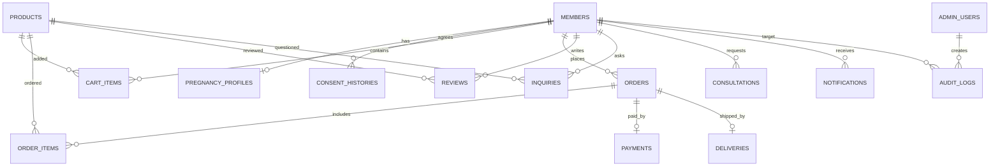

# ERD

1차 데이터 모델은 일반 커머스 흐름에 케어 프로필, 동의 이력, 상담, 감사 로그를 얹는 방식으로 설계합니다.

## 핵심 영역

- 회원/케어 프로필: `Member`, `PregnancyProfile`
- 개인정보/동의: `ConsentHistory`, `AuditLog`
- 콘텐츠: `CareContent`
- 커머스: `Product`, `CartItem`, `Order`, `OrderItem`, `Payment`, `Delivery`, `Coupon`
- 고객 접점: `Review`, `Inquiry`, `Consultation`, `Notification`
- 관리자: `AdminUser`

## 관계도

## 도메인별 의도

`PregnancyProfile`은 임신 주차, 출산 예정일, 출산일, 임신/산후 상태를 관리합니다. 일반 커머스의 회원 정보와 달리 콘텐츠 추천, 상품 추천, 상담 문맥에 활용될 수 있는 도메인 데이터입니다.

`ConsentHistory`는 약관, 개인정보, 마케팅, 민감정보 동의 이력을 별도로 저장합니다. 최신 상태만 덮어쓰지 않고 이력을 남겨 법무/운영 관점에서 추적 가능하게 합니다.

`AuditLog`는 관리자가 회원 정보나 케어 프로필처럼 민감한 정보를 조회하거나 운영 데이터를 내보낼 때 남기는 접근 기록입니다.

`Consultation`은 단순 상품 문의와 분리된 상담 흐름입니다. CS/운영팀이 상태를 변경하고 내부 메모를 남길 수 있게 설계합니다.
